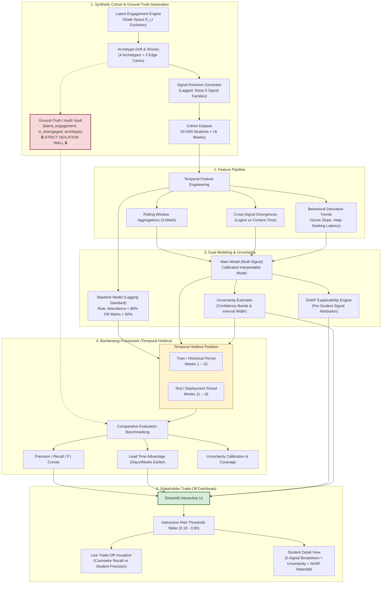

# System Architecture: Transparent Disengagement Early-Warning System

## 1. End-to-End Pipeline Overview

The system processes multi-source behavioral signals to deliver early, uncertainty-aware disengagement alerts while providing complete visibility into stakeholder trade-offs.

---

## 2. Component Specifications

### 2.1 Latent Data Generation & Ground-Truth Isolation
* **Latent Process**: Generates continuous true engagement $E_{i,t} \in [0.0, 1.0]$. The binary label `is_disengaged` is defined as $E_{i,t} < 0.40$ for at least 2 consecutive weeks.
* **Information Barrier**: To prevent data leakage, the columns `latent_engagement`, `is_disengaged`, and `archetype` are strictly quarantined into an audit vault. They are used **exclusively** during backtest evaluation and error analysis; they are never passed into feature sets or model training routines.
* **Realistic Signal Weakness**: Teacher notes and pulse surveys include simulated observational lag ($\sim 1\text{--}2$ weeks) and stochastic noise ($\sigma = 0.25$), preventing them from acting as cheat readouts of ground truth.

### 2.2 Feature Engineering Pipeline
* **Multi-Signal Rolling Metrics**: 3-week rolling means, variances, and rate-of-change metrics for attendance, activity, assessments, and help-seeking.
* **Behavioral Divergence Features**: Computes ratios like `logins_per_active_hour` to catch gaming behaviors where students trigger logins without substantive learning activity.
* **Proactive Trajectory Features**: Extracts 3-week linear regression slopes for assessment scores and tutoring session attendance to separate recovering students from deteriorating ones.

### 2.3 Dual Models
1. **Current-Practice Baseline**:
   - Implements current school status quo: Flags student if $\text{Attendance Rate} < 80\%$ OR $\text{Cumulative Marks} < 60\%$.
   - Demonstrates the lagging, punitive nature of status quo indicators.
2. **Main Multi-Signal Model**:
   - Transparent, calibrated model (Calibrated Logistic Regression with engineered interaction terms / Interpretable Tree ensemble).
   - Outputs:
     1. Calibrated Point Probability: $\hat{p}_{i,t} \in [0.0, 1.0]$.
     2. Uncertainty Interval: $[\hat{p}_{\text{lower}}, \hat{p}_{\text{upper}}]$ derived via bootstrapping.
     3. Local Feature Importance: SHAP contribution values explaining which of the 5 signal families drove the risk score.

### 2.4 Backtesting Framework & Temporal Holdout
* **Explicit Split**:
  - **Training / Historical Weeks**: **Weeks 1 – 10**
  - **Testing / Holdout Deployment Weeks**: **Weeks 11 – 16**
* **Why Temporal Holdout Over Random K-Fold Split?**
  In school early-warning applications, standard cross-validation leaks future information to the past (e.g., training on week 14 data to predict week 4 risk). Temporal holdout rigorously simulates deployment: the model is trained on early-semester data and deployed in late semester, measuring whether it flags at-risk students before their final exams or catastrophic grade drops occur.
* **Evaluation Metrics**:
  - **Lead Time (Days/Weeks)**: Earliest week flagged by Main Model vs. Baseline for students who ultimately disengaged.
  - **Recall-Precision Trade-off**: Precision, Recall, and F1 across decision thresholds.
  - **Uncertainty Calibration**: Empirical coverage of the prediction intervals.

### 2.5 Stakeholder Trade-off Dashboard
* Built with Streamlit for zero-dependency local execution.
* Provides an interactive slider over decision threshold $\tau \in [0.10, 0.90]$.
* Dynamically displays:
  - Total number of students flagged.
  - **Academic Counselor Recall** (sensitivity to catching struggling students).
  - **Student/Parent Precision** (proportion of flagged students who are genuinely struggling vs. falsely stigmatized).
  - Detailed student inspection tab with uncertainty intervals and SHAP feature attributions.

### 2.6 Error Boundaries, Edge Cases & Testing Architecture
* The system enforces strict runtime error boundaries:
  - **Ground-Truth Vault Barrier**: `assert_no_ground_truth_leakage()` raises a fatal `ValueError` if audit fields contaminate feature matrices.
  - **Sparse Data Governance Shield**: Suppresses intervention alerts for transfer students with $< 4$ weeks of records and widens uncertainty bounds ($\ge 0.20$).
  - **Restorative Wellness Triage**: Reroutes cases of acute morale/confidence drop without disciplinary marks to non-academic wellness support.
  - **Defensive Imputation**: Strictly trailing `.ffill()` with neutral priors for bi-weekly surveys, avoiding lookahead leakage.
* Full technical details, failure mode responses, and test specifications are documented in [`docs/testing_and_error_handling.md`](testing_and_error_handling.md).
