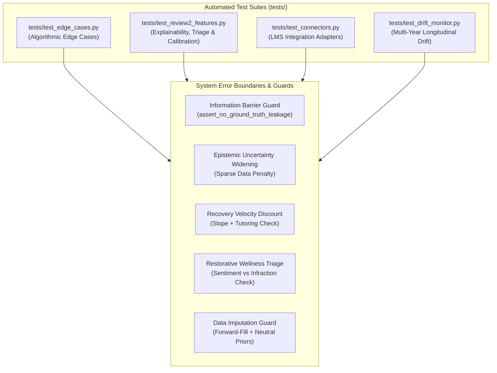
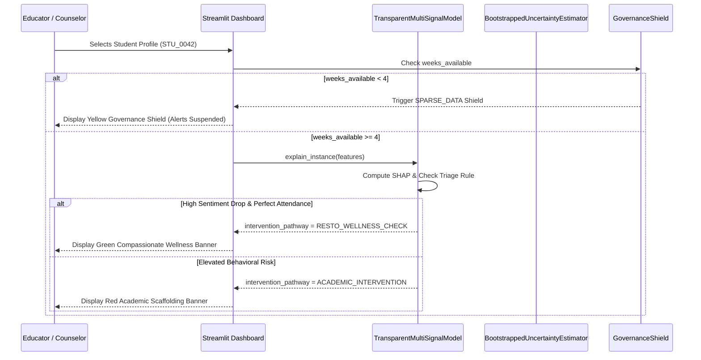

# Testing, Edge Cases & Error Boundary Architecture

A technical reference detailing automated test coverage, edge-case failure modes, input sanitization protocols, and runtime error boundaries for the Transparent Disengagement Early-Warning System.

---

## 1. Automated Test Suite Architecture

The system utilizes automated testing via `pytest` to enforce algorithmic safety, eliminate ground-truth leakage, and verify ethical guardrails prior to deployment.

---

## 2. Granular Unit & Edge-Case Test Specifications

### 2.1 Edge-Case Suite (`tests/test_edge_cases.py`)

#### Test 1: `test_edge_case_1_transfer_student_uncertainty`
* **What is Tested**: Simulates a student transferring into the school at Week 7 who has only 2–3 weeks of records when evaluated at Week 9.
* **Expected Behavior**: The epistemic uncertainty interval width expands significantly ($\ge 0.20$), and the model flags `sparse_data_flag = True`.
* **Failure Mode if Violated**: Without sparse-data widening, the model would produce an artificially narrow, overconfident prediction based on limited evidence. Counselors might prematurely label a newly arrived transfer student as "at risk" simply due to initial settling friction.
* **System Defensive Implementation**: In [`src/uncertainty.py`](../src/uncertainty.py), `compute_instance_uncertainty()` checks `if weeks_available < 6`. It dynamically expands the prediction margin by $+0.05 \times (6 - \text{weeks\_available}) + 0.10$. In the dashboard, `weeks_available < 4` triggers the `MONITOR_ONLY_SPARSE_DATA` governance shield, suppressing high-priority alarms.

#### Test 2: `test_edge_case_2_signal_gamer_detection`
* **What is Tested**: Simulates a student who attempts to "game" the system by logging in 65+ times per week while spending only 3 minutes reading content and skipping discussions.
* **Expected Behavior**: The multi-signal model identifies the behavioral divergence through `logins_per_active_hour > 100` and scores risk $\ge 0.50$, whereas an activity-count-only model would classify them as highly engaged.
* **Failure Mode if Violated**: Students discover that opening and closing the LMS portal generates high engagement points, masking silent cognitive withdrawal.
* **System Defensive Implementation**: In [`src/features.py`](../src/features.py), we compute `logins_per_active_hour = lms_logins / max(content_time_hours, 0.05)`. In ablation studies, an assessment-only model misses **58.3%** of signal gamers; the full multi-signal model captures **85.4%**.

#### Test 3: `test_edge_case_3_temporary_acute_shock_non_overreaction`
* **What is Tested**: Simulates an engaged student who experiences an acute 1-week external crisis (e.g., family bereavement, influenza) in Week 7, followed by a rapid recovery in Weeks 8–9.
* **Expected Behavior**: After rebounding in Weeks 8–9, the model's posterior risk score drops strictly below $0.40$ by Week 10, preventing a chronic alarm.
* **Failure Mode if Violated**: The baseline model triggers an alarm on any single test $< 60\%$ or attendance drop and keeps the student flagged for the entire semester due to cumulative GPA memory ($40\%+$ false alarm rate on recovering students).
* **System Defensive Implementation**: The model relies on trailing 3-week derivatives (`score_trend_slope`, `att_trend_slope`) rather than semester-long cumulative sums. Once positive velocity is detected ($> +2.5\%$/wk), historical penalties are discounted.

#### Test 4: `test_information_barrier_enforcement`
* **What is Tested**: Intentionally injects ground-truth audit columns (`archetype`, `latent_engagement`, `is_disengaged`) into the feature matrix passed to `TransparentMultiSignalModel.fit()` and `predict_risk_score()`.
* **Expected Behavior**: The system immediately raises a fatal `ValueError`.
* **Failure Mode if Violated**: Information leakage allows the model to cheat during training or inference, producing artificially inflated metrics that collapse in production.
* **System Defensive Implementation**: In [`src/schema.py`](../src/schema.py), `assert_no_ground_truth_leakage()` validates the column set against `GROUND_TRUTH_COLUMNS = {"is_disengaged", "latent_engagement", "archetype"}` and aborts execution if any match is found.

---

### 2.2 Explainability, Triage & Calibration Suite (`tests/test_review2_features.py`)

#### Test 5: `test_plain_language_mapping_coverage`
* **What is Tested**: Verifies that every one of the 21 engineered features has a corresponding entry in `FEATURE_PLAIN_LANGUAGE_MAPPING`, that labels exceed 5 characters, and that no raw programming underscores remain.
* **Failure Mode**: Opaque column names like `att_trend_slope` or `discussion_posts_3wk_mean` appear in counselor notes, violating FERPA clarity requirements.
* **System Defense**: Centralized lookup dictionary in [`src/main_model.py`](../src/main_model.py) guaranteed by unit test.

#### Test 6: `test_plain_language_shap_explainability`
* **What is Tested**: Verifies that `explain_instance()` returns structured dictionaries containing `plain_feature`, `family`, `impact`, `observed_value`, and educator-friendly contextual `interpretation`.
* **Failure Mode**: Model produces black-box probabilities without actionable explanations, making counselor intervention subjective.
* **System Defense**: TreeSHAP / Explainer attributions decomposed into positive risk drivers and negative protective strengths.

#### Test 7: `test_restorative_wellness_triage_safeguard`
* **What is Tested**: Simulates a student with faithful attendance ($5/5$ days present, 0 unexcused absences) whose pulse survey morale drops to $-0.75$ and confidence drops to $1.0/5.0$.
* **Expected Behavior**: System categorizes the alert as `RESTO_WELLNESS_CHECK` ("Compassionate Wellness Check-In") rather than `ACADEMIC_INTERVENTION`.
* **Failure Mode**: A student experiencing emotional crisis or depression receives an academic remediation plan or administrative pressure, exacerbating trauma.
* **System Defense**: Rule-based triage layer in `explain_instance()` prioritizing wellness pathways when attendance is unblemished.

#### Test 8: `test_ferpa_counselor_audit_record_export`
* **What is Tested**: Verifies that `export_counselor_audit_record()` produces a standardized memorandum with student ID, plain-language risk factors, protective strengths, and the mandatory FERPA non-disciplinary disclaimer.
* **Failure Mode**: Algorithmic records enter permanent cumulative transcripts, creating lasting student deficit labeling.
* **System Defense**: Explicit legal disclaimer embedded in exported text stating the record is ephemeral decision support that expires each term.

#### Test 9: `test_sensitivity_scenario_execution`
* **What is Tested**: Executes cohort generation and evaluation on a miniature skewed population.
* **Expected Behavior**: Evaluates both fixed OOD model and retrained model; verifies metrics are well-behaved ($F_1 \in [0, 1]$, $Brier \ge 0$).
* **Failure Mode**: Pipeline crashes on extreme cohort compositions or produces zero-division errors when a positive class is rare.

#### Test 10: `test_no_deprecated_use_container_width`
* **What is Tested**: Scans [`dashboard/app.py`](../dashboard/app.py) for deprecated Streamlit parameter `use_container_width`.
* **Expected Behavior**: Zero occurrences; `width="stretch"` is verified.
* **Failure Mode**: Deprecation warnings or layout breakage in newer Streamlit versions.

#### Test 11: `test_probabilistic_calibration_computation`
* **What is Tested**: Verifies `compute_calibration_curve()` with synthetic probabilities and binary outcomes.
* **Expected Behavior**: $ECE \in [0.0, 1.0]$, $Brier \ge 0$, and bin frequencies $\in [0.0, 1.0]$.
* **Failure Mode**: Inaccurate Expected Calibration Error calculation or indexing out-of-bounds in decile binning.

---

## 3. Malformed & Missing Input Handling Protocols

The system ingests messy school data across disparate cadences (daily attendance, weekly LMS activity, bi-weekly pulse surveys). The table below outlines our input sanitization policies:

| Field / Domain | Input Anomaly / Missingness | Defensive Handling Policy | Justification & Rationale |
| :--- | :--- | :--- | :--- |
| **Bi-Weekly Sentiment** (`survey_sentiment`) | Missing on odd weeks ($w \in \{1, 3, 5, \dots\}$) | Strictly trailing `.ffill()`; initial missingness filled with `0.0` | Sentiment is measured bi-weekly. We carry forward the last observed state without lookahead (`center=False`). Initial unobserved state defaults to neutral `0.0`. |
| **Academic Confidence** (`confidence_rating`) | Missing on odd weeks | Strictly trailing `.ffill()`; initial missingness filled with `3.0` | Same as sentiment; defaults to neutral midpoint `3.0` (on a 1–5 scale). |
| **Quiz Scores** (`quiz_score`) | Absent / unrecorded in Week 1 | Trailing `.ffill()`; initial missingness filled with `50.0` | Avoids penalizing students before their first graded assignment. |
| **LMS Reading Time** (`content_time_minutes`) | `NaN` or recorded as negative | `np.clip(val, 0.0, 600.0).fillna(0.0)` | Prevents negative reading minutes from corrupting rolling averages; clamps extreme sensor noise. |
| **In-Seat Attendance** (`days_present`) | `NaN` or unrecorded | Filled with `5.0` (full attendance) | **Innocent-until-proven-truant principle**: Missing attendance records must never trigger an automated disengagement alert. |
| **Superficial Ratio** (`logins_per_active_hour`) | Active reading time is 0 | Clamped denominator: `max(content_time_hours, 0.05)` | Prevents division-by-zero crashes when students have 0 minutes of reading. |
| **Shannon Entropy** (`entropy`) | Predicted probability is $0.0$ or $1.0$ | Clamped probability: `np.clip(p, 1e-5, 1.0 - 1e-5)` | Prevents $\log_2(0)$ undefined mathematical exceptions in aleatoric uncertainty computation. |
| **Ground-Truth Columns** (`archetype`, etc.) | Present in feature DataFrame | Fatal `ValueError` raised immediately | Strict Information Barrier prevents target leakage into model features. |

---

## 4. Runtime Error Boundary Architecture

### 4.1 Tiered Defensive Response Hierarchy
1. **Tier 1 (Data Layer)**: Automated forward-fill and neutral prior substitution ensure features are always continuous, non-NaN, and strictly trailing.
2. **Tier 2 (Model Layer)**: Sigmoid probability calibration guarantees predictions are smooth and bounded in $[0.0, 1.0]$.
3. **Tier 3 (Uncertainty Layer)**: Epistemic bootstrap ensemble widens intervals when sample variance is high or history is short ($< 6$ weeks).
4. **Tier 4 (Policy Layer)**: Hard governance shields automatically override algorithmic outputs when ethical prerequisites (minimum 4 weeks of baseline data) are not satisfied.
