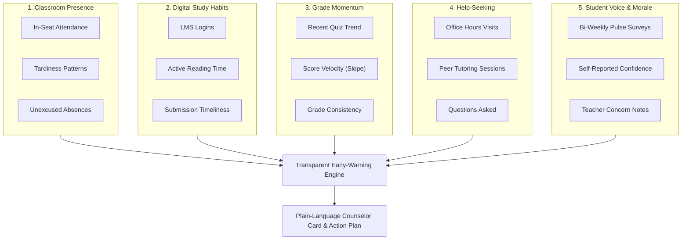
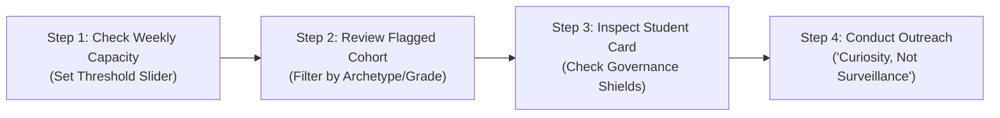

# Educator & Counselor User Guide: Transparent Early-Warning System

**A Practical, Non-Technical Handbook for Academic Counselors, Advisors, Classroom Teachers, and School Leaders**

---

## 1. Why We Built This System: From Autopsy to Early Support

For decades, schools have relied on two numbers to identify struggling students: **attendance falling below 80%** or **cumulative grades dropping below 60%**.

In the educational community, we call these **"autopsy indicators"**:
* By the time attendance hits 75% or report card marks crater to an F, the student has often been silently struggling for 6 to 8 weeks.
* Disengagement is already entrenched, making remediation stressful, costly, and demoralizing for both student and family.
* Most tragically, thousands of students **"quietly struggle"** every year: they sit quietly in class every single day ($5/5$ attendance), turn in blank or partial homework, and silently fall behind without ever triggering an attendance flag.

### Our Solution: A Supportive Behavioral Smoke Detector
This system was created to give counselors and teachers **a gentle, early heads-up**—typically **40 to 49 days earlier** than traditional gradebook flags. It combines five everyday learning patterns into a transparent risk score and plain-English explanations so you can reach out with empathy and curiosity long before a crisis occurs.

---

## 2. What the Risk Score Means (and What It Does NOT Mean)

To protect students and ensure ethical use, all educators must understand these fundamental boundaries:

| What the Early-Warning Score IS | What the Early-Warning Score is NOT |
| :--- | :--- |
| ✅ **A Gentle Smoke Detector**: An early signal that a student's learning momentum is drifting away from healthy habits. | ❌ **NOT an Academic Diagnosis**: It cannot diagnose learning disabilities, ADHD, mental health disorders, or family distress. |
| ✅ **A Resource Prioritization Aid**: Helps counselors with 250+ students decide who would benefit most from a 10-minute check-in this week. | ❌ **NOT a Measure of Intelligence or Worth**: A student with a high score is often capable and bright, but currently overwhelmed, bored, or facing an obstacle. |
| ✅ **A Multi-Signal Pattern**: Examines courseware study time, question-asking, and morale alongside marks and attendance. | ❌ **NOT a Disciplinary Tool**: Under strict school policy, this score **can never be used** to assign detention, deduct marks, revoke privileges, or punish a student. |
| ✅ **An Uncertainty-Aware Tool**: Includes honest confidence bands. Wide bands mean *"We don't know this student well yet—do not assume anything!"* | ❌ **NOT an Infallible Oracle**: It is a human-in-the-loop decision aid. Professional educator judgment always supersedes the algorithm. |

---

## 3. Understanding the 5 Learning Signals (In Plain English)

Rather than judging a student on a single test score, the system examines five distinct areas of school life:

### 1. In-Seat Attendance & Presence
* **What it looks at**: Days present each week, unexcused absences, and arrival tardiness.
* **Why it matters**: While regular attendance is a vital anchor, 100% attendance can mask quiet disengagement. We track attendance trajectory (is attendance slowly eroding week-over-week?).

### 2. Digital Study Habits & Courseware Engagement
* **What it looks at**: Active reading and video review time in the LMS, timely submission of weekly practice, and peer discussion posts.
* **The "Superficial Login" Check**: Some students log into the portal 50 times a week to appear active, but spend only 2 minutes reading. The system measures **active study depth**, not superficial clicks.

### 3. Assessment Trajectory & Momentum (Velocity)
* **What it looks at**: The 3-week trend line of recent quizzes and checks for understanding.
* **Rewarding Recovery**: Conventional gradebooks drag students down with old scores from September. Our system rewards **positive momentum**—if a student failed Quiz 1 but scored higher on Quizzes 2 and 3, their risk score drops immediately.

### 4. Proactive Academic Help-Seeking
* **What it looks at**: Visits to teacher office hours, attendance at peer tutoring, and questions asked in class or on forums.
* **The Silent Red Flag**: When a student's grades dip *and* their help-seeking drops to zero, they are at immediate risk of giving up. Active tutoring attendance acts as a powerful protective shield that suppresses alarms.

### 5. Student Voice, Confidence & Qualitative Morale
* **What it looks at**: The optional 30-second bi-weekly pulse survey ("How manageable does your coursework feel right now?"), self-reported confidence ratings (1 to 5), and objective teacher observation flags.
* **Human Context**: Gives students an authentic voice before academic consequences appear.

---

## 4. The 4-Step Weekly Workflow for Counselors & Advisors

Here is how a school counselor or student success coach uses the platform every Monday morning:

### Step 1: Calibrate the Policy Slider to Your Real Capacity
1. Open the **Stakeholder Trade-Off Dashboard**.
2. Look at your calendar for the week. How many proactive 1-on-1 check-ins can your counseling department realistically conduct?
   * *Example*: If you have capacity for 15 check-ins across your 200-student caseload, adjust the **Intervention Risk Threshold Slider ($\tau$)** so approximately 15 students are highlighted (typically $\tau \approx 0.55\text{ to }0.65$).
   * *The Ethical Trade-Off*: Setting a lower threshold ($\tau = 0.30$) catches every conceivable student (high recall) but introduces more false alarms. Setting a higher threshold ($\tau = 0.70$) ensures you only reach out to students with undeniable behavioral drops (high precision).

### Step 2: Cohort Scan & Status Check
* The dashboard displays students categorized with clear badges:
  - 🚨 **ACADEMIC INTERVENTION**: Significant compound drop across study habits, assessment velocity, and help-seeking.
  - 💚 **COMPASSIONATE WELLNESS CHECK-IN**: Student has low pulse survey morale or confidence, but maintains strong physical attendance and zero disciplinary flags. (See Restorative Protocol below).
  - ⚠️ **MONITOR ONLY (SPARSE DATA)**: Student transferred recently or has $< 4$ weeks of data. Algorithmic alerts are suspended.
  - 🌱 **RECOVERY VELOCITY OBSERVED**: Student is actively improving and attending tutoring. Past GPA drag is discounted.
  - ✅ **STANDARD HEALTHY MONITORING**: Student learning trajectory is stable.

### Step 3: Inspect the Student Card Before Reaching Out
Click on the student's name to view their **5-Tab Detail Card**:
1. **Tab 1: Plain-Language Summary**: Read the 3 primary reasons why the student was highlighted in plain English (e.g., *"Active reading time dropped to 14 mins/week"* and *"No office hours visits in trailing 3 weeks"*).
2. **Tab 2: Local Feature Importance (SHAP)**: See the bar chart showing which factors elevate risk (red bars) and which strengths protect the student (green bars).
3. **Tab 3: 5-Signal Attribution**: Review domain balance (is this an academic pacing issue, a help-seeking reluctance, or an emotional morale drop?).
4. **Tab 4: Longitudinal History**: Inspect the 16-week trend line. Did the drop happen suddenly this week, or has it been a slow 4-week slide?
5. **Tab 5: Confidential FERPA Memorandum**: Preview the pre-formatted, non-stigmatizing consultation memo ready for your private student support notes.

### Step 4: Conduct Proactive Outreach ("Curiosity, Not Surveillance")
* **The Cardinal Rule**: Never tell a student, *"Our AI algorithm flagged you as high-risk for failure."* That induces panic, shame, and defensive behavior.
* **The Approach**: Reach out with warm, conversational curiosity about their experience in specific classes.

---

## 5. Conversational Playbook: Exactly What to Say (and What NOT to Say)

### Scenario A: The "Quietly Struggling" Student
* **Who they are**: Attends class every day ($5/5$ days present), sits quietly, but their online study time has collapsed from 50 mins/week to 12 mins/week, and recent quiz scores dropped.
* ❌ **What NOT to Say**: *"The system noticed you haven't been doing your online reading, and your physics quizzes are failing."*
* ✅ **What to Say**:
  > *"Hi Jason, thanks for stopping by! I was doing my regular mid-semester check-ins and wanted to see how your schedule is feeling. Physics has picked up a lot of momentum this month with the new lab units—how are the problem sets feeling for you right now?"*
* **Scaffolding Action**: Connect Jason with a peer tutor or invite him to attend the weekly Wednesday study table.

---

### Scenario B: The "Turning It Around" Student (Recovery Shield)
* **Who they are**: Failed the first two quizzes in September, but has attended 3 tutoring sessions and their last two quiz grades showed positive improvement ($+3.5$ points/week).
* ❌ **What NOT to Say**: *"Your cumulative grade is still a 54%, so you are on academic probation."*
* ✅ **What to Say**:
  > *"Hey Maya, I wanted to tell you how proud the team is of your effort over the past three weeks. We saw that you've been working regularly with our peer tutors, and your recent quiz scores are showing real upward momentum. How are you feeling about the material now?"*
* **Scaffolding Action**: Affirm their positive recovery velocity. Offer continued tutoring reservation.

---

### Scenario C: The "Superficial Login Gamer"
* **Who they are**: Logging into the LMS 65 times a week, but spending only 3 minutes reading content. Submissions are frequently late or incomplete.
* ❌ **What NOT to Say**: *"We caught you gaming the login tracker to pretend you're working."*
* ✅ **What to Say**:
  > *"Hi Carlos, I wanted to check in about your study workflow. We find that students sometimes feel they have to juggle logging in constantly throughout the day between other commitments. Let's talk about setting aside dedicated, focused blocks of 30 minutes for reading so you don't feel like you're constantly on call."*
* **Scaffolding Action**: Teach time-blocking and study pacing; clarify expectations around reading depth versus click frequency.

---

### Scenario D: The New Transfer Student (Sparse Data Shield)
* **Who they are**: Transferred into the district 2 weeks ago. Has only 2 weeks of assignments and grades recorded.
* **System Action**: Displays a bright yellow **Governance Shield** (`MONITOR_ONLY_SPARSE_DATA`) and widens the uncertainty interval.
* **Counselor Action**: Do **NOT** issue an intervention alert or contact parents about disengagement.
* ✅ **What to Say**:
  > *"Welcome to West High, Alex! Starting at a new school mid-semester is a huge adjustment. How are your classes feeling? Have you had any trouble finding your classrooms, connecting to the school Wi-Fi, or accessing your online textbooks?"*

---

### Scenario E: The Compassionate Wellness Check-In (Restorative Triage)
* **Who they are**: In-seat attendance is strong ($5/5$), zero unexcused absences, zero disciplinary marks. However, their pulse survey morale dropped sharply ($-0.65$), self-reported confidence fell to $1.5/5.0$, and recent teacher notes indicate withdrawal.
* **System Action**: Highlights the green **Compassionate Wellness Badge** (`RESTO_WELLNESS_CHECK`).
* **Counselor Action**: This is **NOT** an academic remediation case. Do not lecture on study hours or test marks.
* ✅ **What to Say**:
  > *"Hi Sam, I wanted to invite you in for a quick chat and check in on how you're feeling personally. Senior year can get so heavy, and sometimes life outside of school takes a toll. How are you doing, and how can we support you right now?"*
* **Scaffolding Action**: Provide access to wellness counseling, pastoral care, or flexible timeline accommodations if experiencing personal or family crisis.

---

## 6. Classroom Teacher Checklist: How You Power the System

Classroom teachers are the eyes and ears of the school. The model relies on your qualitative observations:

1. **Protect the 30-Second Friday Pulse**:
   - Give students 2 minutes at the end of class every other Friday to complete the 3-question pulse survey on their phones or laptops.
   - Emphasize that responses are confidential and help teachers adjust lesson pacing.
2. **File Objective, Factual Observation Notes**:
   - When a student's demeanor changes (e.g., normally vocal student sitting silently in the back, or repeated head-on-desk behavior), log a brief 1-sentence note in the student information system.
   - *Keep notes factual and neutral*: *"Student appeared unusually fatigued and did not participate in group lab activity on 10/12."* Avoid subjective judgments (*"Student was lazy"*).
3. **Log Tutoring & Office Hours Promptly**:
   - If a student visits you during advisory or office hours, record their presence. The system counts help-seeking as a major protective factor that lowers false alarms.

---

## 7. Data Privacy, FERPA & Ethical Standards

* **No Permanent Transcript Marks**: All risk scores, intervals, and SHAP breakdowns are **strictly temporary decision-support aids**. They expire at the end of each term and are never written to the student's permanent cumulative transcript or sent to colleges.
* **FERPA Compliance**: Student records are strictly restricted to authorized counselors and assigned classroom teachers. No algorithmic decision is made without a human educator in the loop.
* **Right to Explanation**: If a parent or student asks why an intervention check-in was scheduled, counselors can use the **Tab 5 FERPA Consultation Memorandum** to provide a clear, transparent explanation in plain English without exposing proprietary algorithms or technical jargon.

---

## 8. Frequently Asked Questions (FAQ) for Educators

**Q1: Can this system be used to automatically assign students to detention or remedial tracks?**  
**A**: **Absolutely not.** School district policy strictly forbids using this score for punitive actions, grade reductions, or automated scheduling changes. It is exclusively an invitation for human support.

**Q2: Why does the system show a range (e.g., [0.42, 0.78]) instead of just one number?**  
**A**: The range is an **uncertainty interval**. In real life, human behavior is complex and data can be noisy. A narrow range (e.g. $[0.72, 0.78]$) means the system has 12+ weeks of clear evidence. A wide range means data is sparse or signals are mixed, advising the counselor to proceed with extra care.

**Q3: What should I do if the system flags a student, but I know they are doing fine?**  
**A**: Trust your human judgment! Check their student card to see why the flag fired (for example, did they submit one assignment late?). Simply mark the alert as "Reviewed - No Action Needed." Your feedback helps improve the school's policy threshold.

**Q4: How does the system handle students with 504 plans or IEP accommodations?**  
**A**: Accommodations (such as extended time) must be accounted for by the counselor. Because the system looks at multiple signals (including help-seeking and sentiment) rather than strict attendance cutoffs, it is significantly less prone to penalizing students with medical or accommodation-related absences.
